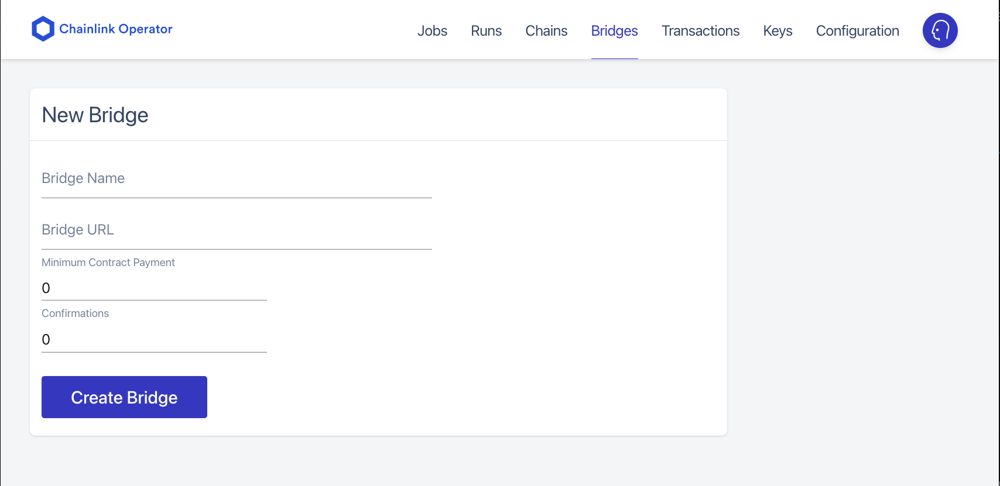

## Getting Started

### Prerequisites

- chainlink node

  `For local node`

  ```sh
    cd .chainlink-node
    docker compose up
  ```

  `For cloud`

  Please refer to [chainlink docs](https://docs.chain.link/docs/running-a-chainlink-node/) to set up a node on cloud
  In case you are running a node on google cloud, start local user interface and visit at `localhost:6688`

  ```sh
  gcloud compute --project "chainlink-hackathon" ssh --zone "asia-southeast1-b" "chainlink-kovan" -- -L 6688:localhost:6688
  ```

  make sure the node has some testnet eth ([get testnet eth](https://faucets.chain.link/))

### Installation

1. Start external adapters

```sh
  cd ./halffin-adapter
  yarn emulator:start
```

2. Create `bridge` in chainlink node ui



3. Deploy oracle contract

```sh
  cd ./halffin-contract
  brownie run scripts/oracle_node/01_deploy_oracle.py --network kovan
```

4. Create oracle jobs in the chainlink node ui, Replace `ORACLE_CONTRACT_ADDRESS` with the deployed contract address from `step 3` and `BRIDGE_NAME` with bridge created in `step 2`

   - get tracking details

     ```toml
     type = "directrequest"
     schemaVersion = 1
     name = "get-tracking"
     contractAddress = "ORACLE_CONTRACT_ADDRESS"
     maxTaskDuration = "0s"
     observationSource = """
       decode_log   [type="ethabidecodelog"
                     abi="OracleRequest(bytes32 indexed specId, address requester, bytes32 requestId, uint256 payment, address callbackAddr, bytes4 callbackFunctionId, uint256 cancelExpiration, uint256 dataVersion, bytes data)"
                     data="$(jobRun.logData)"
                     topics="$(jobRun.logTopics)"]

       decode_cbor  [type="cborparse" data="$(decode_log.data)"]
       fetch        [type=bridge name="BRIDGE_NAME" requestData="{\\"id\\" : $(jobSpec.externalJobID), \\"data\\" : { \\"trackingNo\\" : $(decode_cbor.trackingNo), \\"slug\\" : $(decode_cbor.slug)}}"]
       parse        [type="jsonparse" path="data,tracking,tag" data="$(fetch)"]
       encode_data  [type="ethabiencode" abi="(bytes32 value)" data="{ \\"value\\": $(parse) }"]
       encode_tx    [type="ethabiencode"
                     abi="fulfillOracleRequest(bytes32 requestId, uint256 payment, address callbackAddress, bytes4 callbackFunctionId, uint256 expiration, bytes32 data)"
                     data="{\\"requestId\\": $(decode_log.requestId), \\"payment\\": $(decode_log.payment), \\"callbackAddress\\": $(decode_log.callbackAddr), \\"callbackFunctionId\\": $(decode_log.callbackFunctionId), \\"expiration\\": $(decode_log.cancelExpiration), \\"data\\": $(encode_data)}"
                   ]
       submit_tx    [type="ethtx" to="ORACLE_CONTRACT_ADDRESS" data="$(encode_tx)"]

       decode_log -> decode_cbor -> fetch -> parse -> encode_data -> encode_tx -> submit_tx
     """
     ```

for more information about tasks description, Please visit [chainlink docs](https://docs.chain.link/docs/tasks/)
